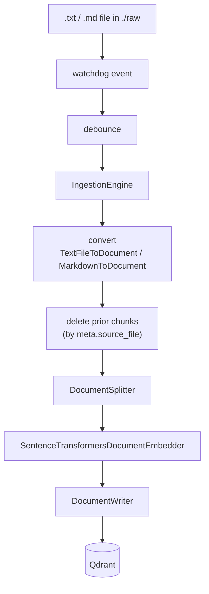

# ingest-memory-rag

Watches a folder and, whenever a `*.txt` or `*.md` file is **added or updated**,
ingests it into a [Qdrant](https://qdrant.tech/documentation/) vector database
through a [Haystack](https://docs.haystack.deepset.ai/docs/intro) indexing
pipeline. Re-ingesting a changed file replaces its previous chunks, so the store
never accumulates stale content.

File watching is cross-platform via [`watchdog`](https://github.com/gorakhargosh/watchdog):
inotify on Linux, FSEvents/kqueue on macOS, ReadDirectoryChangesW on Windows —
the same code runs unchanged everywhere.

## How it works



Each chunk is tagged with `meta.source_file`; on update the engine deletes all
chunks with that `source_file` before writing the new ones.

## Requirements

- Docker + Docker Compose — to run the full stack, **or**
- for local development: Python 3.11 or 3.12, [uv](https://docs.astral.sh/uv/), and a running Qdrant at `http://localhost:6333`

## Setup

### Run the full stack with Docker (recommended)

`docker compose up` starts **both** Qdrant and the ingestion app. The app waits
until Qdrant is healthy, then watches the bind-mounted `./raw` folder.

```bash
docker compose up --build      # start Qdrant + the app
# ...then add or edit a .txt / .md file in ./raw on your host
docker compose down            # stop everything
```

- The app reaches Qdrant over the compose network (`QDRANT_URL=http://qdrant:6333`) — no code change, just env.
- `./raw` is bind-mounted into the container, and `WATCH_USE_POLLING=true` is set so
  host changes are detected across the mount (Docker Desktop does not deliver
  native FS events there).

### Run locally (development)

```bash
docker compose up -d qdrant    # just the database
uv sync --frozen               # install from the lockfile
uv run ingest-memory-rag       # watch ./raw, ingest into localhost:6333
```

Drop or edit a `.txt` / `.md` file in `./raw` and watch it get indexed. Inspect
the collection at <http://localhost:6333/dashboard>.

> The first run downloads the embedding model (`all-MiniLM-L6-v2`, ~90 MB).

## Configuration

All settings are read from the environment (see [`.env.example`](.env.example)):

| Variable | Default | Description |
| --- | --- | --- |
| `WATCH_FOLDER` | `./raw` | Folder to watch (created if missing) |
| `QDRANT_URL` | `http://localhost:6333` | Qdrant endpoint |
| `QDRANT_INDEX` | `Document` | Collection name |
| `EMBEDDING_MODEL` | `sentence-transformers/all-MiniLM-L6-v2` | Sentence-Transformers model |
| `EMBEDDING_DIM` | `384` | Vector size — **must match the model** |
| `SPLIT_BY` / `SPLIT_LENGTH` / `SPLIT_OVERLAP` | `word` / `200` / `30` | Chunking |
| `DEBOUNCE_SECONDS` | `1.0` | Coalesce rapid save events |
| `SCAN_ON_START` | `true` | Ingest existing matching files on startup |
| `QDRANT_RECREATE_INDEX` | `false` | Drop and recreate the collection at startup |
| `WATCH_USE_POLLING` | `false` | Poll instead of native FS events (needed for bind mounts on Docker Desktop) |

## Development

```bash
uv sync                 # install runtime + dev dependencies
uv run ruff check .     # lint
uv run ruff format .    # format
uv run mypy             # type-check
uv run pytest           # fast unit tests (no network / no Qdrant), ≥80% coverage
```

## License

This project is licensed under the MIT License — see [LICENSE](LICENSE).
