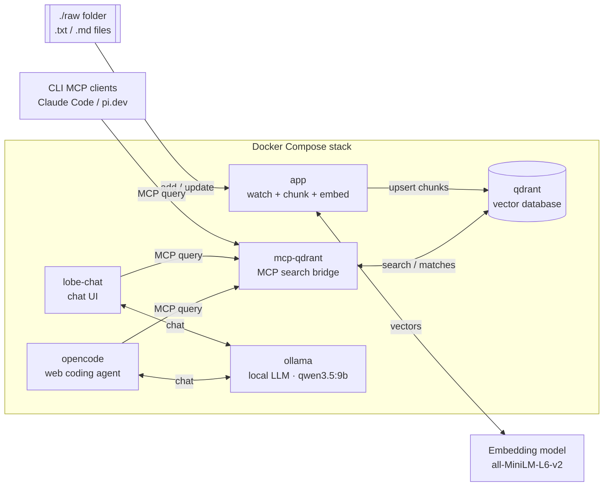
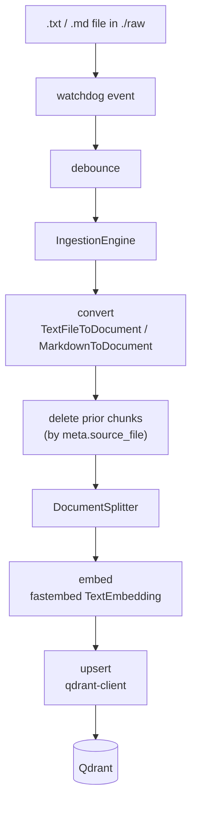

# ingest-memory-rag

Watches a folder and, whenever a `*.txt` or `*.md` file is **added or updated**,
ingests it into a [Qdrant](https://qdrant.tech/documentation/) vector database:
[Haystack](https://docs.haystack.deepset.ai/docs/intro) converters and a splitter
parse and chunk the file, [fastembed](https://github.com/qdrant/fastembed) turns
each chunk into a vector, and the
[qdrant-client](https://github.com/qdrant/qdrant-client) upserts them. Re-ingesting
a changed file replaces its previous chunks, so the store never accumulates stale
content.

File watching is cross-platform via [`watchdog`](https://github.com/gorakhargosh/watchdog):
inotify on Linux, FSEvents/kqueue on macOS, ReadDirectoryChangesW on Windows —
the same code runs unchanged everywhere.

## How it works

At a systems level there are two paths: a **write path** that keeps Qdrant in
sync with your files, and a **read path** that lets MCP clients — the CLI agents
and the LobeChat UI — query them, with LobeChat able to answer using a local
Ollama model. The full Docker Compose stack:



Each chunk is tagged with `meta.source_file`; on update the engine deletes all
chunks with that `source_file` before writing the new ones, so the store never
accumulates stale content.

<details>
<summary>Detailed pipeline (code-level view)</summary>



</details>

## Requirements

- Docker + Docker Compose — to run the full stack, **or**
- for local development: Python 3.11 or 3.12, [uv](https://docs.astral.sh/uv/), and a running Qdrant at `http://localhost:6333`

## Setup

### Run the full stack with Docker (recommended)

`docker compose up` starts the whole stack — Qdrant, the ingestion `app`, the
`mcp-qdrant` bridge, the [LobeChat](https://github.com/lobehub/lobe-chat) UI
(<http://localhost:3210>), and a local `ollama` server (with `ollama-pull`
fetching the models listed in `compose/opencode/opencode.json` into it). The app waits until Qdrant is
healthy, then watches the bind-mounted `./raw` folder.

```bash
docker compose up --build      # start qdrant + app + mcp-qdrant + lobe-chat + ollama (+ ollama-pull)
# ...then add or edit a .txt / .md file in ./raw on your host
docker compose down            # stop everything
```

- The app reaches Qdrant over the compose network (`QDRANT_URL=http://qdrant:6333`) — no code change, just env.
- `mcp-qdrant` serves the ingested collection over MCP so LobeChat can search it — see [MCP → LobeChat](#lobechat-chat-ui-via-docker-compose).
- `ollama` + `ollama-pull` give LobeChat a local model provider — see [Local model via Ollama](#local-model-via-ollama).
- `./raw` is bind-mounted into the container, and `WATCH_USE_POLLING=true` is set so
  host changes are detected across the mount (Docker Desktop does not deliver
  native FS events there).

**Compose services**

| service | image | host port(s) | purpose |
| --- | --- | --- | --- |
| `qdrant` | `qdrant/qdrant:latest` | 6333 (REST + web UI `/dashboard`), 6334 (gRPC) | Vector database storing the ingested chunks |
| `app` | built from `.` (`ingest-memory-rag`) | none | Watches `./raw` and ingests `.txt`/`.md` into Qdrant |
| `mcp-qdrant` | `ghcr.io/astral-sh/uv` (runs `mcp-server-qdrant`) | 8000 (Streamable HTTP, `/mcp`) | MCP bridge for semantic search over the collection |
| `ollama` | `ollama/ollama:latest` | 11434 | Local LLM server (provider for LobeChat) |
| `ollama-pull` | `ollama/ollama:latest` | none (one-shot) | One-shot job: pulls the models in `compose/opencode/opencode.json` (`provider.ollama.models`) into `ollama`, then exits |
| `lobe-chat` | `lobehub/lobe-chat:1.143.3` | 3210 | Chat UI; RAG via `mcp-qdrant`, models via Ollama/OpenAI/Anthropic |
| `opencode` | built from `compose/opencode/` (`ubuntu:26.04` + opencode) | 4096 | Web coding agent; uses the local Ollama provider |

Every long-running service (`qdrant`, `app`, `mcp-qdrant`, `ollama`, `lobe-chat`, `opencode`) has a healthcheck and CPU/memory resource limits — see `docker-compose.yml`. `ollama-pull` is a one-shot job with no healthcheck.

### Run locally (development)

```bash
docker compose up -d qdrant    # just the database
uv sync --frozen               # install from the lockfile
uv run ingest-memory-rag       # watch ./raw, ingest into localhost:6333
```

Drop or edit a `.txt` / `.md` file in `./raw` and watch it get indexed. Inspect
the collection at <http://localhost:6333/dashboard>.

> The first run downloads the embedding model (`all-MiniLM-L6-v2`, ~90 MB).

## Configuration

All settings are read from the environment (see [`.env.example`](.env.example)):

| Variable | Default | Description |
| --- | --- | --- |
| `WATCH_FOLDER` | `./raw` | Folder to watch **recursively** — subfolders included (created if missing) |
| `WATCH_IGNORE` | `.watchignore` | Gitignore-style ignore file (relative to `WATCH_FOLDER`) listing paths to skip — reloaded **live** when edited |
| `QDRANT_URL` | `http://localhost:6333` | Qdrant endpoint |
| `QDRANT_INDEX` | `Document` | Collection name |
| `EMBEDDING_MODEL` | `sentence-transformers/all-MiniLM-L6-v2` | Sentence-Transformers model |
| `EMBEDDING_DIM` | `384` | Vector size — **must match the model** |
| `SPLIT_BY` / `SPLIT_LENGTH` / `SPLIT_OVERLAP` | `word` / `200` / `30` | Chunking |
| `DEBOUNCE_SECONDS` | `1.0` | Coalesce rapid save events |
| `SCAN_ON_START` | `true` | Ingest existing matching files on startup |
| `QDRANT_RECREATE_INDEX` | `false` | Drop and recreate the collection at startup |
| `WATCH_USE_POLLING` | `false` | Poll instead of native FS events (needed for bind mounts on Docker Desktop) |
| `WATCH_REMOVE` | `false` | **Destructive**, opt-in: delete a source file after it is successfully ingested |

`.txt`/`.md` files are ingested **recursively** from `WATCH_FOLDER` and its
subfolders. To exclude files, add a **`.watchignore`** at the `WATCH_FOLDER`
root (change the name/path with `WATCH_IGNORE`). It uses the same syntax as
`.gitignore` — globs, `**`, `!` negation, `/`-anchoring, trailing-`/` for
directories, and `#` comments — matched relative to `WATCH_FOLDER`:

```gitignore
drafts/            # skip everything under <WATCH_FOLDER>/drafts
**/scratch.md      # skip scratch.md at any depth
private-*.txt      # skip private-*.txt files
!private-keep.txt  # …but re-include this one
```

The ignore file is **watched and reloaded live** — edit it and the new rules
take effect within a debounce window (`DEBOUNCE_SECONDS`), **no restart needed**.
In the Docker stack it is bind-mounted **read-only** into the `app` container at
**`/app/raw/.watchignore`** (`WATCH_FOLDER=/app/raw`, `WATCH_IGNORE=.watchignore`);
edit the `.watchignore` at the **host repo root** and the container picks it up.

> **Docker Desktop single-file bind-mount caveat:** edit the file **in place**
> (append/overwrite). Editors that save via atomic write-then-rename swap the
> file's inode, which may not propagate through a *single-file* bind mount; if a
> live edit doesn't take effect, run `docker compose restart app` as a fallback.

**`WATCH_REMOVE`** (default `false`) is an **opt-in, destructive** switch that
deletes each source file *after* it has been successfully ingested. A file is
removed only when at least one chunk was written; if ingestion stores nothing
(0 chunks) or fails, the file is **kept** and the reason is logged. This applies
to both the startup scan and live events. A failed delete is logged and does not
crash the watcher. Leave it off unless you deliberately want ingested files
consumed from `WATCH_FOLDER`.

## Development

```bash
uv sync                 # install runtime + dev dependencies
uv run ruff check .     # lint
uv run ruff format .    # format
uv run mypy             # type-check
uv run pytest           # fast unit tests (no network / no Qdrant), ≥80% coverage
```

### Project board (GitHub Pages)

The Backlog.md tasks are published as a **static, read-only Kanban board** at
**<https://carlessanagustin.github.io/ingest-memory-rag/>**. It is a **responsive
Tailwind card layout** generated from `backlog task list --json` by
`scripts/build_board_site.sh` — a single **self-contained** HTML page (Tailwind is
compiled at build time and inlined; no CDN or external resources). It is not the
interactive `backlog browser` (that stays local; see below).

- **Deploy:** the [`Deploy backlog board to Pages`](.github/workflows/pages.yml)
  workflow rebuilds and publishes the board on every push to `main` that touches
  `backlog/**` (or the build script / workflow), and can be triggered manually
  from the Actions tab (`workflow_dispatch`).
- **One-time setup:** in the repo, open **Settings → Pages → Build and deployment
  → Source** and choose **GitHub Actions**. The workflow cannot flip this setting
  itself, so the first deploy only serves once this is set.
- **Preview locally:** `bash scripts/build_board_site.sh` writes the page to
  `_site/index.html` (gitignored) — open it in a browser. Requires the `backlog`
  CLI, `uv`, and **Node** (the script fetches a pinned Tailwind CLI to compile the
  CSS); CI already has all three.

For the full interactive board (drag/edit tasks) run `backlog browser` locally;
it serves at <http://127.0.0.1:6420> and is not published.

## MCP (query the ingested data)

Ingestion writes a Qdrant collection the official
[`mcp-server-qdrant`](https://github.com/qdrant/mcp-server-qdrant) can serve, so
MCP clients (Claude Code, opencode, pi.dev, LobeChat) can run semantic search
over your ingested files. With Qdrant running and data ingested, start the server
over SSE:

```bash
QDRANT_URL=http://localhost:6333 COLLECTION_NAME=Document \
EMBEDDING_MODEL=sentence-transformers/all-MiniLM-L6-v2 \
FASTMCP_HOST=127.0.0.1 FASTMCP_PORT=8000 \
  uvx mcp-server-qdrant --transport sse
```

Remote clients (opencode, pi.dev) connect to that SSE endpoint
**`http://127.0.0.1:8000/sse`**; Claude Code instead runs the server locally over
stdio (below), so it needs no separate process and no authentication. Keep
`EMBEDDING_MODEL` as `all-MiniLM-L6-v2` (384-dim) so queries match the ingested
vectors.

### LobeChat (chat UI, via Docker Compose)

`docker compose up` also starts a [LobeChat](https://github.com/lobehub/lobe-chat)
web UI plus an `mcp-qdrant` bridge that serves your ingested collection over MCP
(**Streamable HTTP**) — no separate host process. Wiring them together lets you
*chat* with your ingested files. Qdrant is reached purely through MCP; LobeChat's
built-in knowledge base (PostgreSQL/pgvector) is intentionally not used here.

1. **Start the stack** and open the UI:

   ```bash
   docker compose up --build      # includes lobe-chat + mcp-qdrant
   ```

   Then browse to <http://localhost:3210>.

2. **Configure an LLM provider** — MCP tools need a model that supports
   tool/function calling. Either set a key before starting (the `lobe-chat`
   service reads it from your `.env`)…

   ```dotenv
   OPENAI_API_KEY=sk-...
   # or
   ANTHROPIC_API_KEY=sk-ant-...
   ```

   …or add one in the app under **Settings → AI Service Provider**.

   The local **Ollama** provider (`qwen3.5:9b`) is enabled by default and needs no
   key, but a 9B model is only *moderately* reliable at tool-calling — it may emit
   the `qdrant-find` call without acting on the result. Prompt it explicitly
   (*"use qdrant-find …"*) and retry if needed; for consistently DB-grounded
   answers prefer a cloud model (OpenAI/Anthropic) via a key above.

3. **Add the Qdrant MCP plugin.** In LobeChat's plugin/tool store, add a custom
   MCP plugin with:

   - **Type:** `Streamable HTTP`
   - **URL:** `http://mcp-qdrant:8000/mcp`

   LobeChat connects to MCP servers **server-side**, from inside its container, so
   use the compose service name `mcp-qdrant` (not `localhost`). The bridge is also
   published on the host at `http://localhost:8000/mcp` for a LobeChat running
   outside this compose network.

4. **Verify.** Enable the plugin in a chat and ask something answerable only from
   your ingested files, e.g. *"Use qdrant-find to search my notes for agentic
   coding and summarise what you find."* LobeChat invokes the `qdrant-find` tool
   and answers from the ingested content.

#### Local model via Ollama

`docker compose up` also brings up an `ollama` service and an `ollama-pull`
one-shot job that fetches the models in `compose/opencode/opencode.json` into it (persisted in
`./storage/ollama`), and wires `lobe-chat` to it (`ENABLED_OLLAMA=1`,
`OLLAMA_PROXY_URL=http://ollama:11434`). `lobe-chat` waits for `ollama` to be
healthy before starting, so the model is available as soon as the UI is up —
no API key required.

1. In LobeChat, open **Settings → AI Service Provider** and select **Ollama**.
2. Pick one of the pulled models (e.g. **`qwen3.5:9b`**) — `ollama-pull` fetches every model listed in `compose/opencode/opencode.json`.
3. Chat as usual — requests now go to the in-network `ollama` server instead of
   OpenAI/Anthropic.

> **CPU-only caveat:** Docker Desktop has no GPU passthrough, so
> `ollama` runs CPU-only (see the commented GPU block in `docker-compose.yml`
> for a Linux + NVIDIA host). A 9B model on CPU still responds slowly but is much
> lighter (`qwen3.5:9b` is ~6.6 GB) — expect higher latency than the
> hosted OpenAI/Anthropic providers, and make sure Docker Desktop's VM has
> enough memory allocated before trying it.

### opencode (web coding agent, via Docker Compose)

`docker compose up --build` also builds and starts [opencode](https://opencode.ai)
— an agentic coding tool — serving its **web UI on host port 4096**. The image is
built from `ubuntu:26.04` (`compose/opencode/Dockerfile`) using the official
installer; the container runs `opencode web --hostname 0.0.0.0 --port 4096` so the
host can reach it.

```bash
docker compose up --build      # includes opencode + ollama
```

Then browse to <http://localhost:4096>.

- **Model provider.** opencode is wired to the local `ollama` service via
  `compose/opencode/opencode.json`, which registers Ollama as an OpenAI-compatible
  provider (`http://ollama:11434/v1`) and exposes the pulled model `qwen3.5:9b`.
  Select it in the model picker — no external API key required. The service waits
  for `ollama` to be healthy before starting.
- **Data & auth.** Sessions and auth persist in `./storage/opencode` (mounted at
  `/root/.local/share/opencode`).
- **Ingested-docs search (RAG).** The Qdrant MCP bridge is pre-wired in
  `compose/opencode/opencode.json` at `http://mcp-qdrant:8000/mcp`. opencode
  connects **server-side** from inside the compose network, so it uses the service
  name `mcp-qdrant` (not `localhost`), and the service waits for `mcp-qdrant` to be
  healthy before starting. opencode loads the `qdrant-find` tool at startup — ask it
  to search your ingested notes (e.g. *"use qdrant-find to search my notes for
  agentic coding and summarise"*) and it answers from the `Document` collection.

> **Security:** the server runs unauthenticated by default
> (`OPENCODE_SERVER_PASSWORD` empty), which is fine for local use. Set
> `OPENCODE_SERVER_PASSWORD` (e.g. in your `.env`) before exposing port 4096 on an
> untrusted network.

### Claude Code

Use **stdio** locally — Claude Code launches the server itself, so there is no
separate process to run and no authentication (`mcp-server-qdrant` has none, so an
HTTP/SSE setup would stall on Claude Code's OAuth handshake):

```bash
claude mcp add qdrant \
  -e QDRANT_URL=http://localhost:6333 \
  -e COLLECTION_NAME=Document \
  -e EMBEDDING_MODEL=sentence-transformers/all-MiniLM-L6-v2 \
  -- uvx mcp-server-qdrant
```

Add `--scope project` to write a shared `.mcp.json`, or `--scope user` to enable it
in every project. The equivalent `.mcp.json` entry:

```json
{
  "mcpServers": {
    "qdrant": {
      "command": "uvx",
      "args": ["mcp-server-qdrant"],
      "env": {
        "QDRANT_URL": "http://localhost:6333",
        "COLLECTION_NAME": "Document",
        "EMBEDDING_MODEL": "sentence-transformers/all-MiniLM-L6-v2"
      }
    }
  }
}
```

Restart Claude Code (or reconnect via `/mcp`), confirm `qdrant` is connected and its
`qdrant-find` tool is listed, then ask Claude to search your ingested files.

> Only use SSE (`claude mcp add --transport sse qdrant http://127.0.0.1:8000/sse`)
> for a remote/shared server — and note it needs an auth layer, since Claude Code
> attempts OAuth for HTTP/SSE transports.

### opencode

Add the server to `opencode.json` (project root or `~/.config/opencode/opencode.json`):

```json
{
  "$schema": "https://opencode.ai/config.json",
  "mcp": {
    "qdrant": {
      "type": "remote",
      "url": "http://127.0.0.1:8000/sse",
      "enabled": true
    }
  }
}
```

opencode loads the server's `qdrant-find` tool at startup; ask it to search your
ingested files to confirm.

### pi.dev (Pi coding agent)

Pi has no built-in MCP support — enable it with a community adapter such as
[`pi-mcp`](https://github.com/0xKobold/pi-mcp). After installing the extension,
register the server in its config (for `pi-mcp`, `~/.0xkobold/mcp.json`):

```json
{
  "servers": [
    {
      "name": "qdrant",
      "transport": { "type": "sse", "url": "http://127.0.0.1:8000/sse" },
      "enabled": true,
      "autoReconnect": true
    }
  ]
}
```

In Pi, run `/mcp discover` (or `/mcp status`) to confirm the `qdrant-find` tool is
available, then ask it to search your ingested files. The exact config path and
format follow the adapter you choose.

## License

This project is licensed under the MIT License — see [LICENSE](LICENSE).
