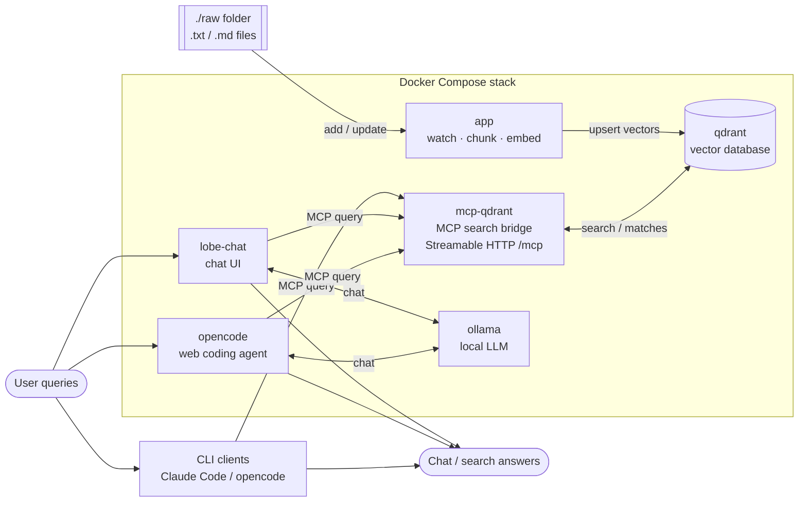
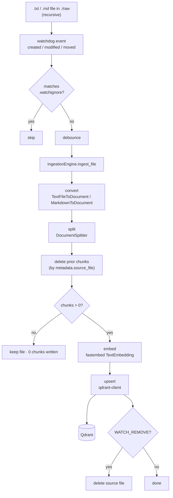

# ingest-memory-rag

Point it at a folder and it automatically ingests your `.txt` and `.md` files
into a searchable vector database — every time you add or change a file, its
contents are indexed for you. The payoff: you can search or chat with your own
notes, running entirely on your own machine, no cloud account required.

## How it works

Two paths run side by side: a **write path** that keeps the vector database in
sync with your files, and a **read path** that lets clients query them. On the
write path, [Haystack](https://docs.haystack.deepset.ai/docs/intro) converters
and a splitter parse and chunk each file,
[fastembed](https://github.com/qdrant/fastembed) turns each chunk into a vector,
and the [qdrant-client](https://github.com/qdrant/qdrant-client) upserts them
into [Qdrant](https://qdrant.tech/documentation/). Re-ingesting a changed file
replaces its previous chunks, so the store never accumulates stale content. File
watching is cross-platform via
[`watchdog`](https://github.com/gorakhargosh/watchdog) — inotify on Linux,
FSEvents/kqueue on macOS, ReadDirectoryChangesW on Windows, the same code
everywhere. On the read path, MCP clients — the CLI agents and the LobeChat UI —
run semantic search over the collection, with LobeChat and opencode able to
answer using a local Ollama model.

The full Docker Compose architecture — inputs on the left, services in the
middle, outputs on the right:



Each chunk is tagged with `metadata.source_file`; on update the engine deletes
all chunks with that `source_file` before writing the new ones, so the store
never accumulates stale content.

<details>
<summary>Detailed pipeline (code-level view)</summary>



Conversion and splitting happen **before** the delete, so a failure leaves the
existing chunks intact; a file that yields 0 chunks is kept, never emptied.

</details>

## Requirements

- **Docker + Docker Compose** — to build and run the full stack (`make up`,
  `make down`, `make build`, `make logs`, `make reset`).
- **Python 3.11 or 3.12 + [uv](https://docs.astral.sh/uv/)** — for local
  development and the quality gate (`make run`, `make test`, `make lint`,
  `make format`, `make typecheck`, `make check`). `make run` also needs a
  running Qdrant at `http://localhost:6333`.

Run `make help` to list every available command.

## Setup

### Run the full stack with Docker (recommended)

`make up` builds and starts the whole stack in the background — Qdrant, the
ingestion `app`, the `mcp-qdrant` bridge, the
[LobeChat](https://github.com/lobehub/lobe-chat) UI (<http://localhost:3210>), a
local `ollama` server (with `ollama-pull` fetching the models listed in
`compose/opencode/opencode.json` into it), and the `opencode` web agent
(<http://localhost:4096>). The app waits until Qdrant is healthy, then watches
the bind-mounted `./raw` folder.

```bash
make up          # build + start everything in the background
make logs        # follow the app + qdrant logs
# ...then add or edit a .txt / .md file in ./raw on your host
make down        # stop everything
```

- `make build` rebuilds the app image; `make reset` wipes ingested Qdrant data
  and container state **but keeps the downloaded Ollama models** (see the
  Makefile for `make reset-hard`, which removes those too).
- The app reaches Qdrant over the compose network
  (`QDRANT_URL=http://qdrant:6333`) — no code change, just env.
- `mcp-qdrant` serves the ingested collection over MCP so LobeChat and opencode
  can search it — see [MCP → LobeChat](#lobechat-chat-ui-via-docker-compose).
- `ollama` + `ollama-pull` give LobeChat and opencode a local model provider —
  see [Local model via Ollama](#local-model-via-ollama).
- `./raw` is bind-mounted into the container, and `WATCH_USE_POLLING=true` is set
  so host changes are detected across the mount (Docker Desktop does not deliver
  native FS events there).

> `make up` wraps `docker compose up --build -d`; run the raw `docker compose …`
> commands directly if you need finer control (e.g. a single service).

**Compose services**

| service | image | host port(s) | purpose |
| --- | --- | --- | --- |
| `qdrant` | `qdrant/qdrant:latest` | 6333 (REST + web UI `/dashboard`), 6334 (gRPC) | Vector database storing the ingested chunks |
| `app` | built from `.` (`ingest-memory-rag`) | none | Watches `./raw` and ingests `.txt`/`.md` into Qdrant |
| `mcp-qdrant` | `ghcr.io/astral-sh/uv:python3.12-bookworm-slim` (runs `mcp-server-qdrant@0.8.1`) | 8000 (Streamable HTTP, `/mcp`) | MCP bridge for semantic search over the collection |
| `ollama` | `ollama/ollama:latest` | 11434 | Local LLM server (provider for LobeChat and opencode) |
| `ollama-pull` | `ollama/ollama:latest` | none (one-shot) | One-shot job: pulls the models in `compose/opencode/opencode.json` (`provider.ollama.models`) into `ollama`, then exits |
| `lobe-chat` | `lobehub/lobe-chat:1.143.3` | 3210 | Chat UI; RAG via `mcp-qdrant`, models via Ollama/OpenAI/Anthropic |
| `opencode` | built from `compose/opencode/` (`ubuntu:26.04` + opencode) | 4096 | Web coding agent; uses the local Ollama provider and the `mcp-qdrant` bridge |

Every long-running service has a healthcheck. CPU/memory limits for the core
services (`qdrant`, `app`, `mcp-qdrant`, `ollama`, `opencode`) are tunable **per
environment** — see [Per-environment resource sizing](#per-environment-resource-sizing)
below. `ollama-pull` is a one-shot job with no healthcheck.

### Per-environment resource sizing

Different VPS hosts can run different resource profiles. Each service's
`deploy.resources` is defined **inline** in its `compose/*.yaml` file with
interpolated values and a built-in default, e.g. for `ollama`:

```yaml
limits:
  cpus: "${OLLAMA_CPU_LIMIT:-6}"
  memory: ${OLLAMA_MEM_LIMIT:-24G}
```

A **tier** is just a set of those values, held in a dotenv file under
[`environments/`](environments/) — `small.env`, `medium.env`, `large.env` — and
**`DEPLOY_ENV`** in `.env` picks which one the `make` targets load:

```dotenv
# .env
DEPLOY_ENV=small        # small | medium | large   (default: medium)
```

`make up` / `down` / `build` / `logs` run
`docker compose --env-file environments/$DEPLOY_ENV.env --env-file .env …`, so the
tier's numbers override the inline defaults, and `.env` (loaded last) can still
override any single value. Because the limits live *with* each service (not in a
separate file), commenting a service out of the `include:` list in
`docker-compose.yml` removes that service **and** its limits together — no
orphaned-service errors. `medium` matches the built-in defaults, so a bare
`docker compose up` (no `make`, no tier file) still gets sensible limits.

- **Tune a tier:** edit the numbers in `environments/<tier>.env`.
- **Add a tier** (e.g. `xlarge`): copy an existing file to
  `environments/xlarge.env`, adjust it, and set `DEPLOY_ENV=xlarge`.
- **Override one service ad hoc:** set its var in `.env`, e.g.
  `OLLAMA_MEM_LIMIT=32G`.
- **Check the effective values:**
  `docker compose --env-file environments/large.env --env-file .env config`
  (or `make up DEPLOY_ENV=large`).

### Run locally (development)

```bash
docker compose up -d qdrant    # just the database (no make target for one service)
make sync                      # install runtime + dev deps from the lockfile
make run                       # watch ./raw, ingest into localhost:6333
```

Drop or edit a `.txt` / `.md` file in `./raw` and watch it get indexed. Inspect
the collection at <http://localhost:6333/dashboard>.

> The first run downloads the embedding model (`all-MiniLM-L6-v2`, ~90 MB).

## Configuration

All settings are read from the environment (see [`.env.example`](.env.example)):

| Variable | Default | Description |
| --- | --- | --- |
| `WATCH_FOLDER` | `./raw` | Folder to watch **recursively** — subfolders included (created if missing) |
| `WATCH_IGNORE` | `.watchignore` | Gitignore-style ignore file (relative to `WATCH_FOLDER`) listing paths to skip — reloaded **live** when edited |
| `QDRANT_URL` | `http://localhost:6333` | Qdrant endpoint |
| `QDRANT_INDEX` | `Document` | Collection name |
| `EMBEDDING_MODEL` | `sentence-transformers/all-MiniLM-L6-v2` | Sentence-Transformers model |
| `EMBEDDING_DIM` | `384` | Vector size — **must match the model** |
| `SPLIT_BY` / `SPLIT_LENGTH` / `SPLIT_OVERLAP` | `word` / `200` / `30` | Chunking |
| `DEBOUNCE_SECONDS` | `1.0` | Coalesce rapid save events |
| `SCAN_ON_START` | `true` | Ingest existing matching files on startup |
| `QDRANT_RECREATE_INDEX` | `false` | Drop and recreate the collection at startup |
| `WATCH_USE_POLLING` | `false` | Poll instead of native FS events (needed for bind mounts on Docker Desktop) |
| `WATCH_REMOVE` | `false` | **Destructive**, opt-in: delete a source file after it is successfully ingested |
| `PGID` | `10001` | GID the `app` container runs as (Docker stack only) — set to `id -g` on the host so it matches the group owning `./raw`, needed for `WATCH_REMOVE` to delete files |

`.txt`/`.md` files are ingested **recursively** from `WATCH_FOLDER` and its
subfolders. To exclude files, add a **`.watchignore`** at the `WATCH_FOLDER`
root (change the name/path with `WATCH_IGNORE`). It uses the same syntax as
`.gitignore` — globs, `**`, `!` negation, `/`-anchoring, trailing-`/` for
directories, and `#` comments — matched relative to `WATCH_FOLDER`:

```gitignore
drafts/            # skip everything under <WATCH_FOLDER>/drafts
**/scratch.md      # skip scratch.md at any depth
private-*.txt      # skip private-*.txt files
!private-keep.txt  # …but re-include this one
```

The ignore file is **watched and reloaded live** — edit it and the new rules
take effect within a debounce window (`DEBOUNCE_SECONDS`), **no restart needed**.
In the Docker stack it is bind-mounted **read-only** into the `app` container at
**`/app/raw/.watchignore`** (`WATCH_FOLDER=/app/raw`, `WATCH_IGNORE=.watchignore`);
edit the `.watchignore` at the **host repo root** and the container picks it up.

> **Docker Desktop single-file bind-mount caveat:** edit the file **in place**
> (append/overwrite). Editors that save via atomic write-then-rename swap the
> file's inode, which may not propagate through a *single-file* bind mount; if a
> live edit doesn't take effect, run `docker compose restart app` as a fallback.

**`WATCH_REMOVE`** (default `false`) is an **opt-in, destructive** switch that
deletes each source file *after* it has been successfully ingested. A file is
removed only when at least one chunk was written; if ingestion stores nothing
(0 chunks) or fails, the file is **kept** and the reason is logged. This applies
to both the startup scan and live events. A failed delete is logged and does not
crash the watcher. Leave it off unless you deliberately want ingested files
consumed from `WATCH_FOLDER`.

> **Docker stack + `WATCH_REMOVE` requires a matching group:** `./raw` is a host
> bind mount, and the `app` container's `appuser` can't delete a file unless its
> *group* has write access to the containing host directory. Set `PGID` in
> `.env` to the GID that owns `./raw` on the host — usually your own primary
> group, from `id -g`. Without it, deletes fail with `PermissionError: [Errno
> 13] Permission denied` even though ingestion itself succeeds.

## Development

Run the full quality gate — lint, format check, type-check, and unit tests —
with a single command:

```bash
make check      # lint + format-check + typecheck + unit tests (the CI gate)
make test       # fast unit suite only (no network / no Qdrant), ≥80% coverage
make lint       # ruff check
make format     # ruff format (writes changes)
make typecheck  # mypy
```

CI runs `make check` as the merge gate. `make test-integration` runs the
integration tests against a live Qdrant.

> Each target wraps a `uv run …` command (`uv run ruff check .`,
> `uv run pytest`, `uv run mypy`, …) — run those directly if you prefer.

### Project board (GitHub Pages)

The Backlog.md tasks are published as a static, read-only Kanban board at
**<https://carlessanagustin.github.io/ingest-memory-rag/>** — a single
self-contained HTML page auto-generated from the backlog tasks and redeployed by
GitHub Actions on every push to `main`.

Preview it locally with `bash scripts/build_board_site.sh`, which writes the page
to `_site/index.html` (gitignored) — open it in a browser. For the full
interactive board (drag/edit tasks) run `backlog browser` locally
(<http://127.0.0.1:6420>); it is not published.

## MCP (query the ingested data)

Ingestion writes a Qdrant collection the official
[`mcp-server-qdrant`](https://github.com/qdrant/mcp-server-qdrant) can serve, so
MCP clients (Claude Code, opencode, LobeChat) can run semantic search over your
ingested files. The Docker stack already runs this bridge as the `mcp-qdrant`
service over **Streamable HTTP** at `/mcp`. To run it standalone against a local
Qdrant:

```bash
QDRANT_URL=http://localhost:6333 COLLECTION_NAME=Document \
EMBEDDING_MODEL=sentence-transformers/all-MiniLM-L6-v2 \
FASTMCP_SERVER_HOST=127.0.0.1 FASTMCP_SERVER_PORT=8000 \
  uvx mcp-server-qdrant@0.8.1 --transport streamable-http
```

Remote clients (opencode, LobeChat) connect to that Streamable HTTP endpoint —
**`http://localhost:8000/mcp`** on the host, or **`http://mcp-qdrant:8000/mcp`**
from inside the compose network. Claude Code instead runs the server locally over
stdio (below), so it needs no separate process and no authentication. Keep
`EMBEDDING_MODEL` as `all-MiniLM-L6-v2` (384-dim) so queries match the ingested
vectors.

### LobeChat (chat UI, via Docker Compose)

`docker compose up` (or `make up`) also starts a
[LobeChat](https://github.com/lobehub/lobe-chat) web UI plus an `mcp-qdrant`
bridge that serves your ingested collection over MCP (**Streamable HTTP**) — no
separate host process. Wiring them together lets you *chat* with your ingested
files. Qdrant is reached purely through MCP; LobeChat's built-in knowledge base
(PostgreSQL/pgvector) is intentionally not used here.

1. **Start the stack** and open the UI:

   ```bash
   make up      # includes lobe-chat + mcp-qdrant
   ```

   Then browse to <http://localhost:3210>.

2. **Configure an LLM provider** — MCP tools need a model that supports
   tool/function calling. Either set a key before starting (the `lobe-chat`
   service reads it from your `.env`)…

   ```dotenv
   OPENAI_API_KEY=sk-...
   # or
   ANTHROPIC_API_KEY=sk-ant-...
   ```

   …or add one in the app under **Settings → AI Service Provider**.

   The local **Ollama** provider (`qwen3.5:9b`) is enabled by default and needs no
   key, but a 9B model is only *moderately* reliable at tool-calling — it may emit
   the `qdrant-find` call without acting on the result. Prompt it explicitly
   (*"use qdrant-find …"*) and retry if needed; for consistently DB-grounded
   answers prefer a cloud model (OpenAI/Anthropic) via a key above.

3. **Add the Qdrant MCP plugin.** In LobeChat's plugin/tool store, add a custom
   MCP plugin with:

   - **Type:** `Streamable HTTP`
   - **URL:** `http://mcp-qdrant:8000/mcp`

   LobeChat connects to MCP servers **server-side**, from inside its container, so
   use the compose service name `mcp-qdrant` (not `localhost`). The bridge is also
   published on the host at `http://localhost:8000/mcp` for a LobeChat running
   outside this compose network.

4. **Verify.** Enable the plugin in a chat and ask something answerable only from
   your ingested files, e.g. *"Use qdrant-find to search my notes for agentic
   coding and summarise what you find."* LobeChat invokes the `qdrant-find` tool
   and answers from the ingested content.

#### Local model via Ollama

`docker compose up` (or `make up`) also brings up an `ollama` service and an
`ollama-pull` one-shot job that fetches the models in
`compose/opencode/opencode.json` into it (persisted in `./storage/ollama`), and
wires `lobe-chat` to it (`ENABLED_OLLAMA=1`,
`OLLAMA_PROXY_URL=http://localhost:11434`). `lobe-chat` waits for `ollama` to be
healthy before starting, so the model is available as soon as the UI is up —
no API key required.

1. In LobeChat, open **Settings → AI Service Provider** and select **Ollama**.
2. Pick one of the pulled models (e.g. **`qwen3.5:9b`**) — `ollama-pull` fetches every model listed in `compose/opencode/opencode.json`.
3. Chat as usual — requests now go to the in-network `ollama` server instead of
   OpenAI/Anthropic.

> **CPU-only caveat:** Docker Desktop has no GPU passthrough, so
> `ollama` runs CPU-only (see the commented GPU block in `docker-compose.yml`
> for a Linux + NVIDIA host). A 9B model on CPU still responds slowly but is much
> lighter (`qwen3.5:9b` is ~6.6 GB) — expect higher latency than the
> hosted OpenAI/Anthropic providers, and make sure Docker Desktop's VM has
> enough memory allocated before trying it.

### opencode (web coding agent + CLI)

`make up` also builds and starts [opencode](https://opencode.ai) — an agentic
coding tool — serving its **web UI on host port 4096** (<http://localhost:4096>).
The image is built from `ubuntu:26.04` (`compose/opencode/Dockerfile`) using the
official installer, and the container runs
`opencode web --hostname 0.0.0.0 --port 4096`.

Both the bundled web service and a local CLI opencode are driven by
[`compose/opencode/opencode.json`](compose/opencode/opencode.json):

- **Model provider.** It registers the local `ollama` service as an
  OpenAI-compatible provider (`http://ollama:11434/v1`), exposing the models
  under `provider.ollama.models` (`qwen3.5:9b`, `qwen3:8b`, `nemotron-3-nano:4b`) —
  `ollama-pull` fetches these into `ollama`. Pick
  one in the model picker; the local models need no external API key. The service
  waits for `ollama` to be healthy before starting.
- **Ingested-docs search (RAG).** The Qdrant MCP bridge is pre-wired as the
  `qdrant_remote` server at `http://mcp-qdrant:8000/mcp` (Streamable HTTP).
  opencode connects **server-side** from inside the compose network, so it uses
  the service name `mcp-qdrant` (not `localhost`), and waits for `mcp-qdrant` to
  be healthy before starting.
- **Answer-from-notes agent.** `opencode.json` sets `default_agent: qdrant_only`
  — a locked-down agent (model `deepseek-v4-flash:cloud`) that answers strictly
  from the `qdrant_*` tools. Ask it to search your ingested notes (e.g. *"use
  qdrant-find to search my notes for agentic coding and summarise"*) and it
  answers from the `Document` collection.
- **Data & auth.** Sessions and auth persist in `./storage/opencode` (mounted at
  `/root/.local/share/opencode`).

To point a **local CLI** opencode at a standalone bridge instead, add the server
to `opencode.json` (project root or `~/.config/opencode/opencode.json`):

```json
{
  "$schema": "https://opencode.ai/config.json",
  "mcp": {
    "qdrant_remote": {
      "type": "remote",
      "url": "http://localhost:8000/mcp",
      "enabled": true
    }
  }
}
```

opencode loads the server's `qdrant-find` tool at startup; ask it to search your
ingested files to confirm.

> **Security:** the web server runs unauthenticated by default
> (`OPENCODE_SERVER_PASSWORD` empty), which is fine for local use. Set
> `OPENCODE_SERVER_PASSWORD` (e.g. in your `.env`) before exposing port 4096 on an
> untrusted network.

### Claude Code

Use **stdio** locally — Claude Code launches the server itself, so there is no
separate process to run and no authentication (`mcp-server-qdrant` has none, so an
HTTP setup would stall on Claude Code's OAuth handshake):

```bash
claude mcp add qdrant \
  -e QDRANT_URL=http://localhost:6333 \
  -e COLLECTION_NAME=Document \
  -e EMBEDDING_MODEL=sentence-transformers/all-MiniLM-L6-v2 \
  -- uvx mcp-server-qdrant
```

Add `--scope project` to write a shared `.mcp.json`, or `--scope user` to enable it
in every project. The equivalent `.mcp.json` entry:

```json
{
  "mcpServers": {
    "qdrant": {
      "command": "uvx",
      "args": ["mcp-server-qdrant"],
      "env": {
        "QDRANT_URL": "http://localhost:6333",
        "COLLECTION_NAME": "Document",
        "EMBEDDING_MODEL": "sentence-transformers/all-MiniLM-L6-v2"
      }
    }
  }
}
```

Restart Claude Code (or reconnect via `/mcp`), confirm `qdrant` is connected and its
`qdrant-find` tool is listed, then ask Claude to search your ingested files.

> For a remote/shared server, point Claude Code at the Streamable HTTP endpoint
> instead (`claude mcp add --transport http qdrant http://localhost:8000/mcp`) —
> but note `mcp-server-qdrant` ships no auth and Claude Code attempts OAuth for
> HTTP transports, so a remote setup needs an auth layer in front.

## License

This project is licensed under the MIT License — see [LICENSE](LICENSE).
